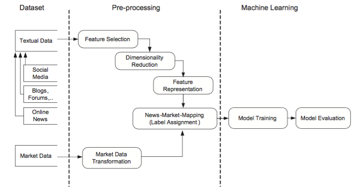

# 予測システムのアーキテクチャ

テキストマイニングによる予測システムは、様々な方法で研究が行われているが大まかなアーキテクチャはだいたい以下のような構造になっている([AK Nassirtoussi, 2014](https://www.researchgate.net/publication/274037232_Text_mining_for_market_prediction_A_systematic_review)
)。

## データセット
予測に使用するデータセットは、大きく分けて2つ。オンライン上のニュースやブログなどのテキストデータと株価などの市場データである。
テキストデータは、
* 主要ウェブニュースサイト
* ブログ・TwitterなどのSNSサイト
* 企業のアニュアルレポートやプレスリリース

の３つのいずれかから取ることが多い。

一番良く使われるのが主要ウェブニュースサイトで、Wall Street JournalやFinancial Timesなどといったサイトである。
これはもちろんUSの市場をターゲットにしてるからで日本だとおそらく、日経新聞とかになるのかな。
Yahoo Financeもよく使われるようだ。

多くの研究では、上記の主要サイトの中でも特に金融に特化したニュースサイトを使うことが多い。これはノイズが少なくなるからとのこと。
また、研究の中では記事のテキストの中でもタイトルのみを使うものと、本文も含めて使うものがあるが、タイトルのみの方が、ノイズが少なく内容をストレートに示すので多数派であるようだ。

最近増えてきたのがブログやTwitterのデータを使った研究。
特にTwitterは、Twitterの投稿だけで市場参加者のムード、感情を分析し市場予測をしている論文もある（[Bollen & Huina, 2011](https://www.researchgate.net/publication/224260930_Twitter_Mood_as_a_Stock_Market_Predictor?el=1_x_8&enrichId=rgreq-fe467dc50a97aab4ffbe244269a168ad-XXX&enrichSource=Y292ZXJQYWdlOzI3NDAzNzIzMjtBUzoyMjU1NzkxMjgzNjUwNTZAMTQzMDc5MzY2MzE2OA==); [Vu, Chang, Ha, & Collier, 2012](https://www.researchgate.net/publication/270878444_An_Experiment_in_Integrating_Sentiment_Features_for_Tech_Stock_Prediction_in_Twitter?el=1_x_8&enrichId=rgreq-fe467dc50a97aab4ffbe244269a168ad-XXX&enrichSource=Y292ZXJQYWdlOzI3NDAzNzIzMjtBUzoyMjU1NzkxMjgzNjUwNTZAMTQzMDc5MzY2MzE2OA==)）。

市場データは、

* 価格・インデックス

価格・インデックスは、予測に使用するデータでなく、予測の目的となることがほとんどだ。
予測は、多くの場合、「上がる」「下がる」「とどまる」のいずれかを予測することが多い。
線形回帰で価格推移を予測するといった研究は少ない。

予測するタイムフレーム（単位）は、短いのは秒単位、長いのは月単位と研究により様々。
データとして扱う期間も短いのは5日間というものから24年分を扱うものまである。

タイムフレームが短いものは、HFTと呼ばれる超高速取引の予測に有効だろうし、タイムフレームが長いものは長期取引の予測に使えるものになるということ。

## 前処理

基本的に、機械学習をする上では、このデータの前処理が一番大変で重要だと言われる。
論文でもこの前処理の方法が機械学習の結果に大きな影響を与えるとのこと（[Uysal & Gunal, 2014](https://www.researchgate.net/publication/257930123_The_impact_of_preprocessing_on_text_classification?el=1_x_8&enrichId=rgreq-fe467dc50a97aab4ffbe244269a168ad-XXX&enrichSource=Y292ZXJQYWdlOzI3NDAzNzIzMjtBUzoyMjU1NzkxMjgzNjUwNTZAMTQzMDc5MzY2MzE2OA==)）。

この前処理は３つのフェーズに分けられる。

* 属性選択(Feature selection)
* 次元削減(Dimensionality reduction)
* 特徴表現(Feature representation)

## 機械学習

